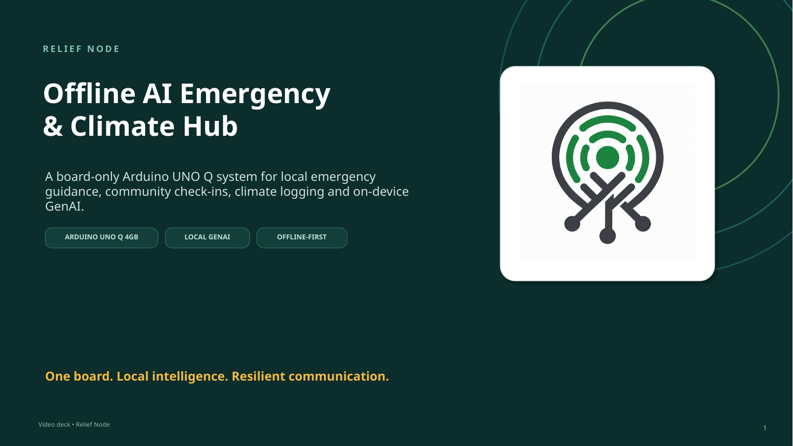
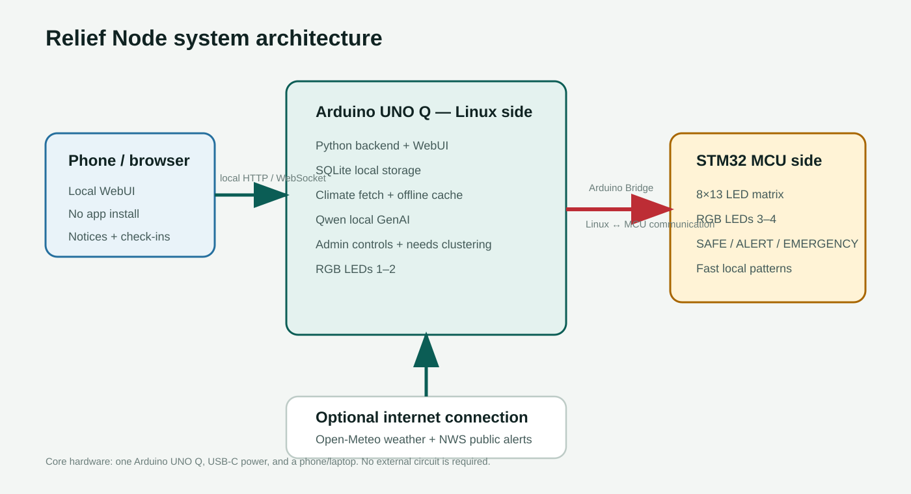
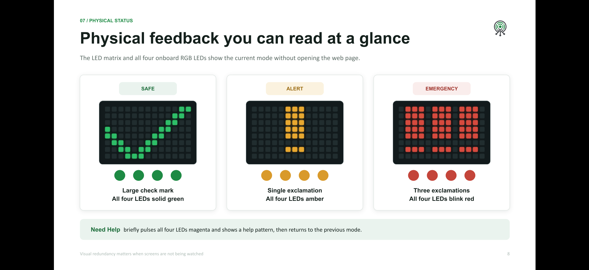

# Relief Node



**Relief Node: Offline AI Emergency & Climate Hub**

Relief Node is a board-only emergency information, community check-in, climate logging, and on-device AI hub built around the Arduino UNO Q 4GB/32GB.

It turns a single UNO Q into a local web server, status beacon, climate-information logger, and AI-assisted communication tool that can remain useful when normal internet services are unreliable.

## Project media

- **Slide deck:** [Relief Node project presentation](https://drive.google.com/file/d/1nXE93il3GRT0-NjDJalkt4E3q_XH1cqQ/view?usp=sharing)
- **Demo + Explantation video:** [Relief Node: A Board-Only Emergency Info and Check-In Hub Video + Explanation](https://youtu.be/iE9aYf_gtv0)

[](https://youtu.be/iE9aYf_gtv0)

[Watch the full demo and explanation on YouTube](https://youtu.be/iE9aYf_gtv0)

- **Only Demo Video:** [Relief Node: A Board-Only Emergency Info and Check-In Hub Demo Video](https://youtu.be/DjlyEn-Kum8)

## The problem

Emergencies such as flooding, severe storms, extreme heat, wildfire conditions, power outages, campus incidents, and temporary community response events can interrupt normal communication at exactly the time people need clear information most.

People still need to know:

- What is happening?
- What should I do?
- Is this location safe?
- Who needs help?
- Who needs water, food, medicine, transportation, charging, or other supplies?

Relief Node provides a local point of communication that does not depend on a remote cloud application for its core workflow.

## What Relief Node does

A nearby user opens the Relief Node page from a normal phone, tablet, or laptop browser. No mobile app or account is required.

Users can:

- read the latest organizer-approved emergency notice;
- check in as **Safe**, **Need Help**, or **Need Supplies**;
- view locally stored community status;
- view weather and public-alert context when available;
- use the interface in multiple languages.

Organizers can:

- unlock a verified Admin Mode with a PIN;
- publish emergency notices;
- review recent check-ins and grouped community needs;
- change the UNO Q physical status;
- configure climate logging;
- generate concise emergency action-card drafts with a local language model;
- generate translation drafts with the same on-device model.

AI output is never auto-published. An organizer must review and approve generated text before it becomes a Relief Node notice.

## System architecture



The Arduino UNO Q combines a Linux application processor with an STM32 microcontroller. Relief Node intentionally uses both.

### Linux side

The Python application runs:

- the local WebUI;
- message handling;
- SQLite storage;
- emergency notices and check-ins;
- community-needs clustering;
- climate-data retrieval and caching;
- on-device language-model inference;
- organizer/admin logic;
- RGB LEDs 1–2.

### STM32 MCU side

The Arduino sketch controls:

- the onboard 8×13 LED matrix;
- RGB LEDs 3–4;
- immediate SAFE, ALERT, EMERGENCY, and HELP visual patterns.

### Arduino Bridge

Arduino Bridge connects the Linux application to the STM32 sketch.

For example:

```text
Organizer selects EMERGENCY
        |
        v
Python / Linux application
        |
        | Arduino Bridge
        v
STM32 sketch
        |
        v
Matrix shows !!! and board enters emergency pattern
```

## Physical status system

The board itself communicates the current state without requiring someone to look at a phone.

| State | LED matrix | Onboard RGB LEDs |
| --- | --- | --- |
| SAFE | Large check mark | All four solid green |
| ALERT | Large exclamation mark | All four amber |
| EMERGENCY | Three exclamation marks | All four blink red |
| New HELP request | Temporary help pattern | All four pulse magenta, then return to the previous state |



## Community check-ins

The local browser interface provides three simple check-in options:

- Safe
- Need Help
- Need Supplies

Check-ins are stored locally in SQLite.

Relief Node also groups common requests into categories such as:

- urgent help;
- medical assistance;
- water;
- food;
- shelter;
- power / charging;
- transportation;
- other supplies.

The original user-entered notes are preserved.

## Climate and public-alert logging

When internet access is available, Relief Node can fetch:

- weather data from Open-Meteo;
- active U.S. public alerts from the National Weather Service.

Successful weather updates are stored as timestamped SQLite snapshots. If connectivity later disappears, the latest successfully cached climate information remains available from the local interface.

This gives Relief Node additional context for climate-related incidents while keeping the emergency workflow local-first.

## On-device generative AI

Relief Node uses a compact local language model declared in `app.yaml`:

```yaml
bricks:
  - arduino:web_ui: {}
  - arduino:llm:
      model: llamacpp:Qwen3.5-0.8B-Q4_0
```

The model runs on the UNO Q after its one-time installation.

The model has two intentionally constrained roles:

1. turn a longer verified emergency notice into a short action-card draft;
2. create an organizer-reviewed translation draft.

The safety flow is:

```text
verified source notice
        |
        v
local GenAI
        |
        v
draft only
        |
        v
human review
        |
        v
approve and publish
```

The model is a communication assistant, not the emergency authority. It does not decide whether an emergency exists or whether an evacuation should occur.

The interface includes a visible warning that AI-generated summaries and translations may sometimes be incomplete or inaccurate.

If local summarization is unavailable, Relief Node can fall back to a deterministic rule-based summary. Translation fails closed instead of silently publishing a low-quality fallback.

## Multilingual interface

The website includes local UI translations for:

- English
- Spanish
- Arabic
- Hindi
- French

Arabic switches the interface to a right-to-left layout.

The local model can also create organizer-reviewed translations for additional target languages.

## Bill of materials

### Hardware

| Component | Quantity | Purpose |
| --- | ---: | --- |
| Arduino UNO Q 4GB / 32GB | 1 | Main Linux + MCU platform |
| USB-C 5 V / 3 A power supply | 1 | Reliable board power |
| USB-C cable | 1 | Power and setup |
| Phone, tablet, or laptop with Wi-Fi | 1+ | Opens the local Relief Node interface |

No external sensors, displays, LEDs, shields, breadboards, Raspberry Pi, or second microcontroller are required for the core prototype.

### Software, apps, and online services

| Software / service | Purpose |
| --- | --- |
| Arduino App Lab | Development and deployment environment |
| Arduino WebUI Brick | Local browser interface |
| Arduino LLM Brick | On-device generative AI |
| Arduino Bridge / RouterBridge | Linux-to-MCU communication |
| Arduino LED Matrix library | Onboard matrix control |
| Qwen 3.5 0.8B Q4_0 | Local summarization and translation |
| SQLite | Local persistent application data |
| Open-Meteo | Public weather data when online |
| U.S. National Weather Service | Active U.S. public alerts when online |
| Pico CSS | Optional interface styling enhancement |
| Modern web browser | Local user interface |

### Hand tools and fabrication

None are required for the board-only prototype.

No soldering iron, breadboard, 3D printer, laser cutter, or fabrication machine is required.

## Schematic / wiring

There is **no external electrical circuit** in the core Relief Node prototype.

All physical feedback uses the UNO Q's onboard LED matrix and RGB LEDs.

The architecture diagram above is therefore the relevant system schematic. Detailed photographs of the physical UNO Q are included in the Hackster submission to show the working board and its status modes.

## How to reproduce the project

### 1. Hardware

Use an Arduino UNO Q 4GB/32GB and a reliable 5 V / 3 A USB-C power supply.

Connect the board to the computer running Arduino App Lab.

### 2. Import the finished App Lab application

This repository contains a ready-to-import release file:

**[`release/UPLOAD_THIS_TO_ARDUINO_APP_LAB.zip`](release/UPLOAD_THIS_TO_ARDUINO_APP_LAB.zip)**

Import that ZIP into Arduino App Lab.

The source files are also included directly in this repository for review.

### 3. Install the local model

Relief Node uses:

```text
Qwen3.5-0.8B-Q4_0
```

If App Lab reports that this local model is not installed, allow App Lab to download it while the UNO Q has internet access.

After the model is installed, inference runs locally on the UNO Q.

### 4. Change the organizer PIN

For a public deployment or demo, change the default prototype PIN in:

```text
python/main.py
```

Look for:

```python
ADMIN_PIN = "2468"
```

### 5. Run the application

Press **Run** in Arduino App Lab.

The WebUI service will print an address similar to:

```text
Network URL: http://10.0.0.207:7000
```

Open the **Network URL** from a phone, tablet, or laptop on the same local network.

Do not use `127.0.0.1` from another device; that address refers to the device running the browser itself.

### 6. Configure climate logging

Unlock Admin Mode and enter:

- location label;
- latitude;
- longitude;
- preferred units.

Select **Save & fetch**.

When internet access is available, the weather and public-alert data are fetched and stored locally.

### 7. Use the local AI

Paste a longer verified emergency notice into the organizer notice field.

Select **Make short action card**.

Relief Node displays progress while the local model works. The generated result remains an editable draft.

For translation, choose a target language and select **Translate draft**. A persistent status indicator shows when translation is running and when it is complete.

Review the result before selecting **Approve & publish notice**.

### 8. Test the physical states

Use the organizer board controls to test:

- SAFE;
- ALERT;
- EMERGENCY.

A submitted **Need Help** check-in also triggers the temporary HELP indication.

## Optional standalone hotspot

The simplest setup is to place the UNO Q and client device on the same Wi-Fi network.

For a more independent deployment, `host_tools/` contains optional NetworkManager scripts for creating a `RELIEF-NODE` Wi-Fi access point on the UNO Q host.

Run these scripts from the UNO Q host shell, not from the App Lab Python container.

See:

```text
host_tools/README.md
```

## Repository structure

```text
relief-node-uno-q/
├── README.md
├── THIRD_PARTY_NOTICES.md
├── app.yaml
├── assets/
│   ├── index.html
│   ├── app.js
│   ├── style.css
│   ├── webui.js
│   └── logo.png
├── python/
│   └── main.py
├── sketch/
│   ├── sketch.ino
│   └── sketch.yaml
├── host_tools/
├── data/
├── media/
│   ├── architecture.svg
│   ├── relief-node-cover.png
│   ├── IMG_5431.PNG
│   └── relief-node-logo.png
└── release/
    └── UPLOAD_THIS_TO_ARDUINO_APP_LAB.zip
```

## Safety and limitations

Relief Node is a contest prototype. It is not a certified emergency-alert, public-safety, medical, or life-safety product.

- Always follow official emergency authorities and emergency services.
- Public weather data may be delayed or unavailable.
- AI-generated summaries and translations may be incomplete or inaccurate.
- Generated emergency communication must be reviewed before publication.
- The organizer PIN is prototype-level access control, not hardened production authentication.
- Community check-ins do not replace contacting emergency services.

## Sustainability

The prototype intentionally minimizes added hardware.

A single UNO Q provides Linux computing, MCU control, storage, networking, an LED matrix, RGB indicators, and local AI capability. This reduces external modules, displays, extra computers, wiring, and electronic material while keeping the same device reusable across shelters, schools, community centers, campuses, clinics, and temporary field deployments.

## Scalability

The core concept is useful as a single local node, but future versions could synchronize multiple Relief Nodes when connectivity is available.

Potential deployments include:

- schools;
- community centers;
- shelters;
- temporary clinics;
- campus safety;
- volunteer response events;
- remote field locations.

## Third-party software and data

Relief Node uses open-source software, an open model, and public data services.

Full attribution and license information is provided in [`THIRD_PARTY_NOTICES.md`](THIRD_PARTY_NOTICES.md).

Weather data attribution: **Weather data by Open-Meteo.**

National Weather Service data does not imply NOAA/NWS endorsement of Relief Node.

## Author

Aymaan Shaikh

## Contest

Built for the Hackster.io **Invent the Future with Arduino UNO Q and App Lab** challenge, Social Impact category.
